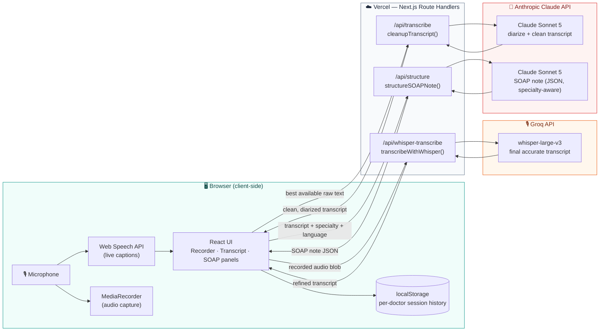
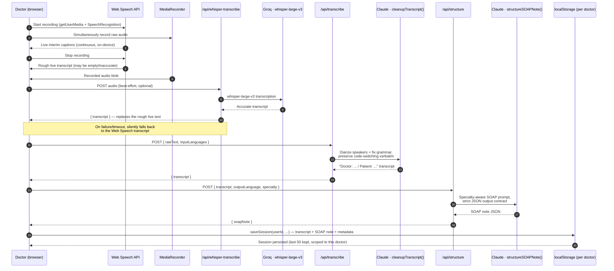
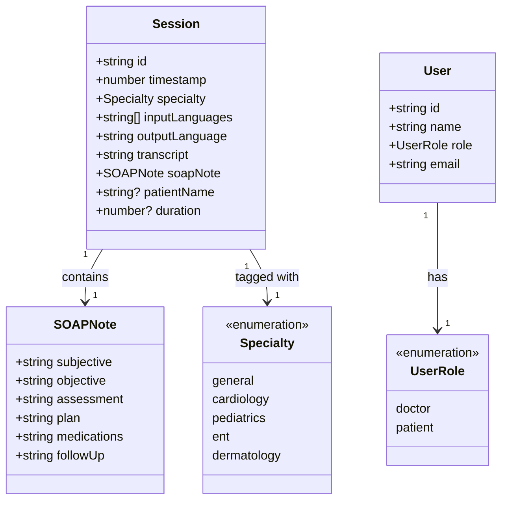
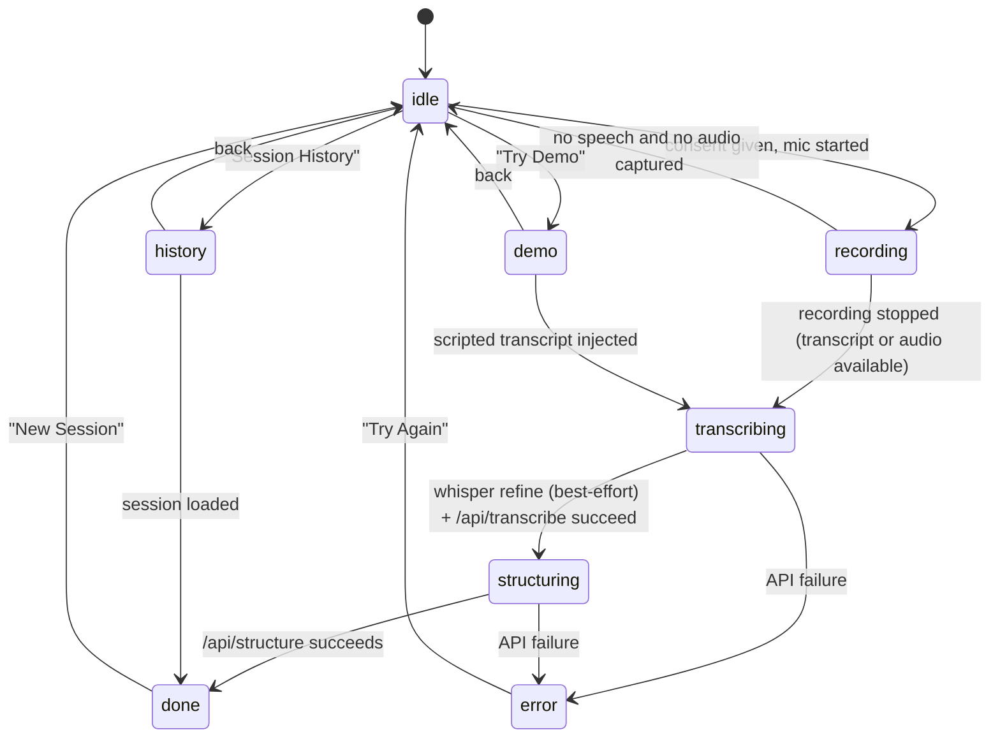

# PolyScribe

**An ambient, multilingual AI clinical scribe.** PolyScribe listens to a doctor–patient consultation, transcribes it live in the browser, refines it with a dedicated speech model, and turns it into a structured, specialty-aware SOAP note — in the language the doctor wants — in seconds.

Built for clinics across India and Southeast Asia, where a single consultation can switch between English, Hindi, Tamil, Malayalam, and half a dozen other languages mid-sentence. PolyScribe is designed to keep up with that code-switching instead of choking on it.

---

## Table of contents

- [How it works, in one picture](#how-it-works-in-one-picture)
- [Tech stack](#tech-stack)
- [Design system](#design-system)
- [Technical pipeline](#technical-pipeline)
- [Data model](#data-model)
- [Application structure](#application-structure)
- [Application state machine](#application-state-machine)
- [Specialty templates](#specialty-templates)
- [Multilingual support](#multilingual-support)
- [Quick-login demo doctors](#quick-login-demo-doctors)
- [Privacy & compliance posture](#privacy--compliance-posture)
- [Getting started](#getting-started)
- [Environment variables](#environment-variables)
- [API reference](#api-reference)
- [Deployment](#deployment)
- [Known limitations](#known-limitations)
- [Extension roadmap](#extension-roadmap)

---

## How it works, in one picture



Audio is captured in the browser and, once a consultation ends, sent once to Groq for a Whisper transcription pass, then discarded, it is never written to disk anywhere in the pipeline. The resulting text (or the live Web Speech transcript, if Whisper isn't configured or the call fails) is processed twice by Claude: once to clean it up and label speakers, once to turn it into a structured clinical note. Nothing touches a database; the finished note is saved straight to the browser's `localStorage`, scoped to the signed-in doctor.

---

## Tech stack

| Layer | Technology | Why |
|---|---|---|
| **Framework** | [Next.js 16](https://nextjs.org) (App Router, Turbopack) | Route Handlers double as a thin backend; one deployable unit on Vercel |
| **UI** | [React 19](https://react.dev) + TypeScript 5 | Component model, strict typing across the whole request/response chain |
| **Styling** | [Tailwind CSS v4](https://tailwindcss.com) + [shadcn/ui](https://ui.shadcn.com) (`base-nova` style) + `tw-animate-css` | Utility-first styling, accessible headless primitives, OKLCH color tokens driving a blue-green glassmorphic design system (see [Design system](#design-system)) |
| **Motion** | [motion](https://motion.dev) (the Framer Motion successor) | Spring-animated nav, entrance transitions, the Cmd+K command palette, glowing/pulsing recorder states |
| **Icons** | [lucide-react](https://lucide.dev) | Consistent icon set across both portals |
| **Live captions** | Browser-native [Web Speech API](https://developer.mozilla.org/docs/Web/API/Web_Speech_API) (`SpeechRecognition`) | Free, on-device, streams interim results live while recording — no network round trip |
| **Final transcription** | [Groq](https://groq.com) running `whisper-large-v3` | A more accurate final pass over the actual recorded audio once the consultation ends, especially for code-switched Indian-language speech; falls back silently to the Web Speech transcript if unavailable |
| **LLM** | [Claude Sonnet 5](https://platform.claude.com) via `@anthropic-ai/sdk` | Transcript diarization/cleanup **and** structured SOAP-note generation |
| **Persistence** | Browser `localStorage`, scoped per doctor (client-side only) | No backend database in this build — see [Known limitations](#known-limitations) |
| **Auth** | In-memory demo credential check (`src/lib/auth-context.tsx`) | Placeholder role-based routing (doctor vs. patient) across ten demo doctor accounts — not production auth, see limitations |
| **Hosting** | [Vercel](https://vercel.com) (Fluid Compute) | Route Handlers run as Vercel Functions; `maxDuration` tuned per route for LLM/ASR latency |

---

## Design system

PolyScribe uses a light, airy "Vitality Glass" design language rather than a conventional flat dashboard look:

- **Blue-green palette.** Teal/emerald gradient accents (`--primary`) over an animated, softly blurred gradient-mesh background (`.gradient-mesh` in `globals.css`), instead of flat panels.
- **Frosted glass surfaces.** Cards, the nav bar, and the Cmd+K palette use `backdrop-filter: blur()` with translucent white surfaces (`.glass`, `.glass-strong`, `.glass-subtle`).
- **Motion throughout.** Spring-animated active-tab indicators, staggered page entrances, a pulsing record button, and animated modal transitions, all via `motion`.
- **Command bar + Cmd+K palette.** A floating glass nav (`command-bar.tsx`) with a keyboard-driven command palette (`command-palette.tsx`) for jumping between Console, History, Demo, Dashboard, Pricing, and Pitch.
- **Specialty accent colors.** Each of the five specialties gets its own accent (teal/rose/amber/sky/violet, see `specialty-icons.tsx`) so the console and dashboard feel varied rather than monochrome.

---

## Technical pipeline

Every consultation goes through the same five-stage pipeline. Stage 1 runs entirely in the browser; stages 2–4 are independent, stateless calls made from Next.js Route Handlers; stage 5 is client-side persistence.



### Stage detail

1. **Capture (client-only).** [`Recorder`](src/components/recorder.tsx) opens `getUserMedia` (with echo cancellation, noise suppression, and auto gain enabled) for a live waveform visualization, starts the browser's `SpeechRecognition` in continuous, interim-results mode for live captions, and simultaneously records the actual audio via `MediaRecorder`.
2. **Final transcription — `POST /api/whisper-transcribe`.** Once recording stops, the recorded audio is sent to [`transcribeWithWhisper()`](src/lib/whisper.ts), which calls Groq's `whisper-large-v3`. This step is best-effort: the app proceeds even if the live Web Speech transcript came back empty, and silently falls back to whatever Web Speech did produce if Groq is unavailable or the call fails, so a flaky third-party call never blocks a consultation.
3. **Cleanup — `POST /api/transcribe`.** The best available raw transcript is sent to [`cleanupTranscript()`](src/lib/transcribe.ts). A single Claude call performs speaker diarization (first speaker is always the doctor, subsequent turns inferred from conversational context, not acoustic signal), fixes speech-recognition artifacts, and **preserves code-switching exactly as spoken** rather than translating it.
4. **Structuring — `POST /api/structure`.** The cleaned transcript, chosen specialty, and desired output language go to [`structureSOAPNote()`](src/lib/claude.ts), which asks Claude for a strict-JSON SOAP note using a specialty-specific prompt (see [Specialty templates](#specialty-templates)).
5. **Persistence (client-only).** The finished `{ transcript, soapNote }` pair is written to `localStorage` via [`sessions.ts`](src/lib/sessions.ts), under a key scoped to the signed-in doctor's user id, capped at the most recent 50 consultations per doctor.

> **Implementation note:** both Claude calls use `claude-sonnet-5` with adaptive thinking on by default — the response's first content block can be a `thinking` block rather than `text`, so both routes explicitly search `message.content` for the `text` block instead of assuming index `0`.

---

## Data model

There's no database — these are the TypeScript interfaces that define the shape of data as it flows through the pipeline and into `localStorage`.



| Type | Defined in | Notes |
|---|---|---|
| `Session` | [`src/lib/sessions.ts`](src/lib/sessions.ts) | One saved consultation. Read/write helpers (`saveSession`, `getSessions`, `getSession`, `deleteSession`, `clearSessions`) all take a `userId` and wrap a per-user `localStorage` key (`polyscribe_sessions_{userId}`); capped at 50 most-recent sessions per doctor |
| `SOAPNote` | [`src/lib/claude.ts`](src/lib/claude.ts) | The six-section clinical note contract Claude is required to return as JSON |
| `Specialty` | [`src/lib/specialty-prompts.ts`](src/lib/specialty-prompts.ts) | Drives which specialty-specific documentation rules get injected into the SOAP prompt |
| `User` / `UserRole` | [`src/lib/auth-context.tsx`](src/lib/auth-context.tsx) | Two roles gate two completely different UIs — doctor console vs. patient dashboard |
| `LanguageConfig` | [`src/components/language-selector.tsx`](src/components/language-selector.tsx) | `{ inputLanguages: string[], outputLanguage: string }` — input is a hint list for the diarizer, output can be a fixed language or `"auto"` (same as source) |
| Starter seed data | [`src/lib/seed-sessions.ts`](src/lib/seed-sessions.ts) | Realistic specialty- and language-matched sessions auto-seeded once, the first time each of the five quick-login doctors logs in (see [Quick-login demo doctors](#quick-login-demo-doctors)) — never overwrites real recordings |

---

## Application structure

```
src/
├── app/
│   ├── api/
│   │   ├── structure/route.ts         # POST — transcript → SOAP note (Claude)
│   │   ├── transcribe/route.ts        # POST — raw speech text → cleaned transcript (Claude)
│   │   └── whisper-transcribe/route.ts # POST — audio blob → accurate transcript (Groq)
│   ├── globals.css                    # Tailwind v4 theme tokens (OKLCH), glassmorphic design system
│   ├── layout.tsx                     # Root layout — fonts, ErrorBoundary, AuthProvider
│   └── page.tsx                       # Single-page app shell + client-side state machine
│
├── components/
│   ├── ui/                            # shadcn primitives (button, card, select, tooltip, …)
│   ├── command-bar.tsx                 # Floating glass nav bar + Cmd+K trigger
│   ├── command-palette.tsx             # Keyboard-driven command palette
│   ├── recorder.tsx                    # Mic capture + live waveform + Web Speech + MediaRecorder
│   ├── transcript-panel.tsx            # Left result panel — cleaned transcript
│   ├── soap-panel.tsx                  # Right result panel — editable SOAP sections, copy/print
│   ├── specialty-selector.tsx          # Specialty template picker
│   ├── language-selector.tsx           # Input/output language picker (23 languages)
│   ├── consent-gate.tsx                # Patient-consent checkpoint before recording unlocks
│   ├── processing-overlay.tsx          # Animated "transcribing / structuring" state
│   ├── impact-stats.tsx                # Real-data stat strip shown on the console (per doctor)
│   ├── session-history.tsx             # Browse/reload/delete past sessions (per doctor)
│   ├── dashboard-page.tsx              # Usage analytics computed from saved sessions (per doctor)
│   ├── demo-mode.tsx                   # Runs pre-scripted multilingual demo consultations
│   ├── login-page.tsx                  # Doctor / patient tab login + five-doctor Quick Login panel
│   ├── patient-dashboard.tsx           # Patient-facing portal
│   ├── pricing-page.tsx                # Marketing/pricing page
│   ├── pitch-page.tsx                  # Hackathon pitch deck page
│   └── error-boundary.tsx              # Top-level React error boundary
│
├── lib/
│   ├── claude.ts                       # Anthropic client + structureSOAPNote()
│   ├── transcribe.ts                   # Anthropic client + cleanupTranscript()
│   ├── whisper.ts                      # Groq client + transcribeWithWhisper()
│   ├── prompts.ts                      # SOAP prompt builder (language + specialty aware)
│   ├── specialty-prompts.ts            # Per-specialty documentation rule sets
│   ├── specialty-icons.tsx             # Per-specialty icon + accent color
│   ├── demo-transcripts.ts             # Scripted multilingual demo consultations
│   ├── seed-sessions.ts                # Starter session history for the five quick-login doctors
│   ├── sessions.ts                     # Per-doctor localStorage session CRUD + auto-seeding
│   ├── auth-context.tsx                # Demo auth provider (ten doctor accounts + one patient)
│   └── utils.ts                        # `cn()` class-merging helper
│
└── types/
    └── speech-recognition.d.ts         # Ambient types for the Web Speech API
```

---

## Application state machine

`page.tsx` drives the whole doctor-facing console off a single `AppState` union. It's a straightforward linear flow with two side-doors (History, Demo) and one recovery path (Error → New Session).



Note: the Console nav tab always resets `appState` back to `idle` when leaving History or Demo, so navigating away and back never leaves the console stuck on a side view.

---

## Specialty templates

Choosing a specialty in the UI injects a dedicated rule set into the SOAP prompt (see [`specialty-prompts.ts`](src/lib/specialty-prompts.ts)) — it doesn't just relabel the note, it changes *what Claude is told to look for*:

| Specialty | Accent | Extra documentation focus |
|---|---|---|
| 🩺 **General Practice** | Teal | Broad organ-system coverage, social history, preventive screening, medication reconciliation |
| ❤️ **Cardiology** | Rose | 7-attribute chest pain characterization, NYHA dyspnea class, murmur grading, risk scores (HEART, TIMI, CHA₂DS₂-VASc), anticoagulant dosing |
| 👶 **Pediatrics** | Amber | Growth percentiles, developmental milestones, weight-based (mg/kg) dosing, vaccination/anticipatory guidance |
| 👂 **ENT** | Sky | Hearing-loss classification, otoscopy/audiometry findings, tonsil grading (0–4), topical administration technique |
| 🔬 **Dermatology** | Violet | Systematic lesion morphology (ABCDE criteria), Fitzpatrick type, topical potency class, biopsy planning |

Adding a new specialty means adding one entry to `SPECIALTIES`, one prompt block to `SPECIALTY_CONTEXT`, one icon/color pair in `specialty-icons.tsx` — no other code changes needed.

---

## Multilingual support

| Capability | Detail |
|---|---|
| **Recognized input languages** | English plus all 22 languages of the Eighth Schedule of the Indian Constitution: Hindi, Bengali, Marathi, Telugu, Tamil, Gujarati, Urdu, Kannada, Malayalam, Odia, Punjabi, Assamese, Maithili, Santali, Kashmiri, Nepali, Sindhi, Konkani, Dogri, Manipuri, Bodo, and Sanskrit (hints for both Web Speech and the diarizer — Claude auto-detects beyond the hint list) |
| **Code-switching** | Preserved verbatim in the cleanup stage — e.g. *"Your BP is high, take this dawai morning and night, theek hai?"* stays mixed rather than being forced into one language |
| **Output language** | Any of the above, or `auto` (matches the dominant language of the consultation) — clinical drug names stay in international form (e.g. *Amoxicillin*) regardless of output language |
| **Romanization handling** | Indian-language words captured in romanized form by the browser's speech recognizer are kept romanized rather than mistranslated |

---

## Quick-login demo doctors

The login page's **Quick Login** panel (doctor tab) signs straight in as one of five doctors, each covering a different specialty and consulting language, with their own auto-seeded, realistic session history and dashboard stats kept completely separate from one another:

| Doctor | Specialty | Language |
|---|---|---|
| Dr. Priya Sharma | General Practice | Hindi |
| Dr. Kavita Iyer | Cardiology | Tamil |
| Dr. Rohan Verma | Pediatrics | Marathi |
| Dr. Ananya Reddy | ENT | Telugu |
| Dr. Vikram Nair | Dermatology | Malayalam |

Five more doctor accounts exist for manual sign-in without a starter history (see [`auth-context.tsx`](src/lib/auth-context.tsx) for the full ten-doctor credential list, all using password `doctor123`), plus one demo patient account.

---

## Privacy & compliance posture

This is a **prototype's stated posture**, not a certified compliance guarantee — see [Known limitations](#known-limitations) before treating it as production-ready for real patient data.

- **No audio persistence.** Audio is captured in the browser; when a final accurate pass is needed it's sent once to Groq for Whisper transcription and immediately discarded, it is never written to disk anywhere in PolyScribe's own infrastructure. If Groq isn't configured, audio never leaves the browser at all and only the browser's own live-caption text is used.
- **Explicit consent gate.** [`ConsentGate`](src/components/consent-gate.tsx) blocks the recorder until the doctor confirms the patient was verbally informed and has consented.
- **Minimal retention.** Only the derived text (transcript + SOAP note) is stored, client-side, in `localStorage`, scoped per doctor and capped at the 50 most recent sessions.
- **Stated targets:** India's DPDP Act 2023 and Singapore's PDPA are referenced in-app as the compliance frameworks this design is aimed at.

---

## Getting started

```bash
git clone https://github.com/subhchandan-003/Polyscribe.git
cd Polyscribe
npm install
cp .env.example .env.local   # then fill in ANTHROPIC_API_KEY (required) and GROQ_API_KEY (optional)
npm run dev                  # http://localhost:4000
```

Speech recognition requires a Chromium-based browser (Chrome/Edge) with microphone access — Web Speech API support elsewhere is inconsistent. On the login page, use the **Quick Login** panel to sign in as any of the five pre-seeded demo doctors without typing credentials.

| Script | Purpose |
|---|---|
| `npm run dev` | Start the dev server (Turbopack) on port `4000` |
| `npm run build` | Production build |
| `npm run start` | Serve the production build |
| `npm run lint` | ESLint (flat config, `eslint-config-next`) |

---

## Environment variables

| Variable | Required | Used by | Purpose |
|---|---|---|---|
| `ANTHROPIC_API_KEY` | ✅ | [`claude.ts`](src/lib/claude.ts), [`transcribe.ts`](src/lib/transcribe.ts) | Transcript cleanup/diarization and SOAP-note generation |
| `GROQ_API_KEY` | Optional | [`whisper.ts`](src/lib/whisper.ts) | Final accurate transcription pass via `whisper-large-v3`. If unset, the app falls back to the browser's live Web Speech transcript |

See [`.env.example`](.env.example). No database URL required — nothing is persisted server-side.

---

## API reference

All three routes are Next.js Route Handlers (`src/app/api/*/route.ts`), stateless, and only ever called from the same origin.

### `POST /api/whisper-transcribe`

Transcribes recorded consultation audio via Groq's `whisper-large-v3` for a more accurate final transcript than the live Web Speech preview.

```jsonc
// Request — multipart/form-data
// audio: Blob (the recorded consultation audio, e.g. audio/webm)
// language: optional 2-letter code, sent only when exactly one input language was selected

// Response 200
{ "transcript": "string" }

// Response 4xx/5xx
{ "error": "string" }
```

`maxDuration: 90`s. Returns 503 if `GROQ_API_KEY` isn't configured, 400 if no audio was provided; callers are expected to fall back to the Web Speech transcript on any non-200 response rather than surfacing an error to the doctor.

### `POST /api/transcribe`

Cleans up the best available raw transcript (Whisper-refined, or Web Speech, if Whisper wasn't used) into a diarized transcript.

```jsonc
// Request
{ "rawText": "string", "inputLanguages": ["en", "hi"] }

// Response 200
{ "transcript": "[Language: English, Hindi]\n\nDoctor: ...\nPatient: ..." }

// Response 4xx/5xx
{ "error": "string" }
```

`maxDuration: 90`s. Rejects text under 5 characters (400) and surfaces Claude auth/rate-limit failures as 502/429 respectively.

### `POST /api/structure`

Turns a cleaned transcript into a structured, specialty-aware SOAP note.

```jsonc
// Request
{
  "transcript": "string",
  "outputLanguage": "en | hi | ta | ... | auto",
  "specialty": "general | cardiology | pediatrics | ent | dermatology"
}

// Response 200
{
  "soapNote": {
    "subjective": "string", "objective": "string", "assessment": "string",
    "plan": "string", "medications": "string", "followUp": "string"
  }
}
```

`maxDuration: 120`s. Rejects transcripts under 10 characters (400); unrecognized specialties silently fall back to `general`.

---

## Deployment

Deployed on **Vercel**, framework auto-detected as Next.js. `vercel.json` pins the build/install commands and preferred region; each API route sets its own `maxDuration` (route segment config) so Vercel's function timeout doesn't cut off a long Claude or Groq call before the app's own internal timeout does.

```jsonc
// vercel.json
{
  "buildCommand": "npm run build",
  "installCommand": "npm install",
  "framework": "nextjs",
  "regions": ["sin1"]
}
```

1. Import the GitHub repo into Vercel.
2. Set `ANTHROPIC_API_KEY` (required) and `GROQ_API_KEY` (optional) under **Project Settings → Environment Variables** for Production (and Preview/Development if you use them).
3. Deploy — no build-time secrets or database provisioning required.

---

## Known limitations

Deliberate simplifications made to ship a working prototype fast — flagged explicitly so they're not mistaken for oversights:

- **Auth is a demo stub.** [`auth-context.tsx`](src/lib/auth-context.tsx) checks against eleven hardcoded credential pairs and stores the session in `sessionStorage`. There is no real user database, password hashing, or session token — not suitable for real patient data as-is.
- **No backend database.** All consultation history lives in the browser's `localStorage`, per-device and per-doctor, capped at 50 sessions each. Clearing browser data or switching devices loses history; nothing is shared across doctors or synced anywhere.
- **Speaker diarization is text-only, not acoustic.** Claude infers "Doctor" vs. "Patient" purely from conversational context (who's asking vs. answering), not from any audio signal — it can mislabel unusual exchanges. See [Extension roadmap](#extension-roadmap).
- **Speech recognition is browser-dependent.** The Web Speech API is only reliably available in Chromium-based browsers and is itself cloud-backed by Chrome; the Whisper pass mitigates this but requires `GROQ_API_KEY` to be configured.
- **No audit trail.** Because there's no backend, there's no durable, tamper-evident log of who recorded what, when — a real compliance requirement for clinical documentation.
- **Patient portal isn't linked to real notes yet.** The patient dashboard's consultation list is a placeholder; there's currently no mechanism for a doctor to share a specific saved note with a specific patient account.

---

## Extension roadmap

Natural next steps if this moves beyond prototype:

- **Link doctor notes to patient accounts** — the prerequisite for most other patient-tab features: let a doctor assign/share a saved SOAP note with a specific patient login so "Recent Consultations" becomes real.
- **Acoustic or manual speaker diarization** — replace or augment Claude's text-only speaker guessing with either a manual "patient is speaking" toggle (keeps the current no-audio-persisted privacy model) or true acoustic diarization via a provider that supports speaker labels (bigger privacy tradeoff, since it requires processing raw audio server-side).
- **Real backend & auth** — replace the demo auth stub with a proper identity provider and a database (e.g. Postgres via [Neon](https://neon.tech) or [Supabase](https://supabase.com) on the Vercel Marketplace) so sessions persist across devices and are queryable per-clinician.
- **EHR / FHIR integration** — export generated SOAP notes as [HL7 FHIR](https://hl7.org/fhir/) `DocumentReference` or `Encounter` resources for interoperability with hospital EMR systems.
- **Streaming SOAP generation** — stream the Claude response token-by-token to the SOAP panel instead of waiting for the full JSON payload, cutting perceived latency.
- **Audit logging & access control** — durable, append-only logs of consultation access for compliance, plus per-clinic role-based access control.
- **More specialties & custom templates** — let clinics define their own specialty prompt blocks instead of the fixed five.
- **Multi-note formats** — beyond SOAP, support formats like DAP or free-text discharge summaries per clinic preference.
- **Offline-first / PWA** — cache the app shell so recording still works on flaky clinic Wi-Fi, syncing notes once connectivity returns.
- **Patient-facing extras** — plain-language note summaries, a medication list rolled up across visits, translate-my-note-to-my-language, and a visit transparency log.

---

## License

No license file is currently included — treat this repository as **all rights reserved** by default unless the repository owner adds one.
