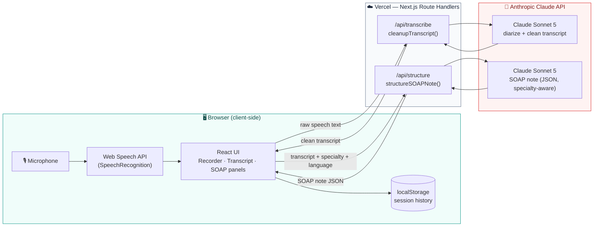
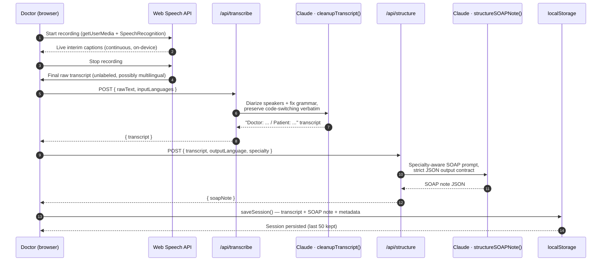
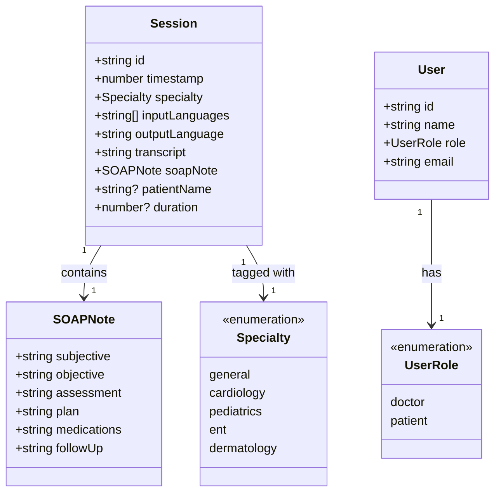
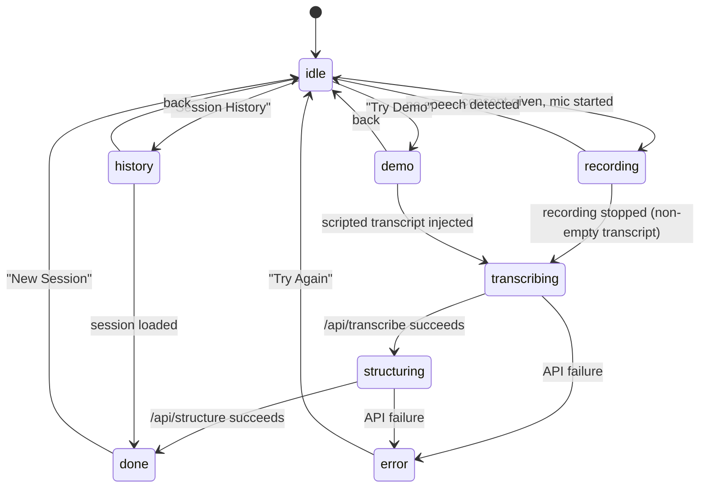

# PolyScribe

**An ambient, multilingual AI clinical scribe.** PolyScribe listens to a doctor–patient consultation, transcribes it live in the browser, and turns it into a structured, specialty-aware SOAP note — in the language the doctor wants — in seconds.

Built for clinics across India and Southeast Asia, where a single consultation can switch between English, Hindi, Tamil, Malay, and half a dozen other languages mid-sentence. PolyScribe is designed to keep up with that code-switching instead of choking on it.

---

## Table of contents

- [How it works, in one picture](#how-it-works-in-one-picture)
- [Tech stack](#tech-stack)
- [Technical pipeline](#technical-pipeline)
- [Data model](#data-model)
- [Application structure](#application-structure)
- [Application state machine](#application-state-machine)
- [Specialty templates](#specialty-templates)
- [Multilingual support](#multilingual-support)
- [Privacy & compliance posture](#privacy--compliance-posture)
- [Getting started](#getting-started)
- [Environment variables](#environment-variables)
- [API reference](#api-reference)
- [Deployment](#deployment)
- [Known limitations](#known-limitations)
- [Extension roadmap](#extension-roadmap)

---

## How it works, in one picture



Audio itself never leaves the browser and is never stored — only the text the browser's own speech recognizer produces gets sent to the server. That text is processed twice by Claude: once to clean it up and label speakers, once to turn it into a structured clinical note. Nothing touches a database; the finished note is saved straight to the browser's `localStorage`.

---

## Tech stack

| Layer | Technology | Why |
|---|---|---|
| **Framework** | [Next.js 16](https://nextjs.org) (App Router, Turbopack) | Route Handlers double as a thin backend; one deployable unit on Vercel |
| **UI** | [React 19](https://react.dev) + TypeScript 5 | Component model, strict typing across the whole request/response chain |
| **Styling** | [Tailwind CSS v4](https://tailwindcss.com) + [shadcn/ui](https://ui.shadcn.com) (`base-nova` style) + `tw-animate-css` | Utility-first styling, accessible headless primitives, OKLCH color tokens for a clinical-teal (doctor) / warm-emerald (patient) dual theme |
| **Icons** | [lucide-react](https://lucide.dev) | Consistent icon set across both portals |
| **Speech-to-text** | Browser-native [Web Speech API](https://developer.mozilla.org/docs/Web/API/Web_Speech_API) (`SpeechRecognition`) | Free, on-device, streams interim results live — no audio ever leaves the device |
| **LLM** | [Claude Sonnet 5](https://platform.claude.com) via `@anthropic-ai/sdk` | Transcript diarization/cleanup **and** structured SOAP-note generation — the only external AI dependency |
| **Persistence** | Browser `localStorage` (client-side only) | No backend database in this build — see [Known limitations](#known-limitations) |
| **Auth** | In-memory demo credential check (`src/lib/auth-context.tsx`) | Placeholder role-based routing (doctor vs. patient) — not production auth, see limitations |
| **Hosting** | [Vercel](https://vercel.com) (Fluid Compute) | Route Handlers run as Vercel Functions; `maxDuration` tuned per route for LLM latency |

---

## Technical pipeline

Every consultation goes through the same four-stage pipeline. Stages 1–2 run entirely in the browser; stages 3–4 are two independent, stateless Claude calls made from Next.js Route Handlers.



### Stage detail

1. **Capture (client-only).** [`Recorder`](src/components/recorder.tsx) opens `getUserMedia` for a live waveform visualization and starts the browser's `SpeechRecognition` in continuous, interim-results mode. This is 100% client-side — no network call, no audio upload.
2. **Cleanup — `POST /api/transcribe`.** The raw, unlabeled transcript is sent to [`cleanupTranscript()`](src/lib/transcribe.ts). A single Claude call performs speaker diarization (first speaker is always the doctor), fixes speech-recognition artifacts, and — critically — **preserves code-switching exactly as spoken** rather than translating it, so a sentence that mixes Hindi and English medical terms stays mixed.
3. **Structuring — `POST /api/structure`.** The cleaned transcript, chosen specialty, and desired output language go to [`structureSOAPNote()`](src/lib/claude.ts), which asks Claude for a strict-JSON SOAP note using a specialty-specific prompt (see [Specialty templates](#specialty-templates)) and translates the clinical content into the requested output language if needed.
4. **Persistence (client-only).** The finished `{ transcript, soapNote }` pair is written to `localStorage` via [`sessions.ts`](src/lib/sessions.ts), capped at the most recent 50 consultations, and immediately available in [Session History](src/components/session-history.tsx).

> **Implementation note:** both Claude calls use `claude-sonnet-5` with adaptive thinking on by default — the response's first content block can be a `thinking` block rather than `text`, so both routes explicitly search `message.content` for the `text` block instead of assuming index `0`.

---

## Data model

There's no database — these are the TypeScript interfaces that define the shape of data as it flows through the pipeline and into `localStorage`.



| Type | Defined in | Notes |
|---|---|---|
| `Session` | [`src/lib/sessions.ts`](src/lib/sessions.ts) | One saved consultation. Read/write helpers (`saveSession`, `getSessions`, `getSession`, `deleteSession`, `clearSessions`) wrap `localStorage`; capped at 50 most-recent sessions |
| `SOAPNote` | [`src/lib/claude.ts`](src/lib/claude.ts) | The six-section clinical note contract Claude is required to return as JSON |
| `Specialty` | [`src/lib/specialty-prompts.ts`](src/lib/specialty-prompts.ts) | Drives which specialty-specific documentation rules get injected into the SOAP prompt |
| `User` / `UserRole` | [`src/lib/auth-context.tsx`](src/lib/auth-context.tsx) | Two roles gate two completely different UIs — doctor console vs. patient dashboard |
| `LanguageConfig` | [`src/components/language-selector.tsx`](src/components/language-selector.tsx) | `{ inputLanguages: string[], outputLanguage: string }` — input is a hint list for the diarizer, output can be a fixed language or `"auto"` (same as source) |

---

## Application structure

```
src/
├── app/
│   ├── api/
│   │   ├── structure/route.ts     # POST — transcript → SOAP note (Claude)
│   │   └── transcribe/route.ts    # POST — raw speech text → cleaned transcript (Claude)
│   ├── globals.css                # Tailwind v4 theme tokens (OKLCH), dual color system
│   ├── layout.tsx                 # Root layout — fonts, ErrorBoundary, AuthProvider
│   └── page.tsx                   # Single-page app shell + client-side state machine
│
├── components/
│   ├── ui/                        # shadcn primitives (button, card, select, tooltip, …)
│   ├── recorder.tsx                # Mic capture + live waveform + Web Speech API
│   ├── transcript-panel.tsx        # Left result panel — cleaned transcript
│   ├── soap-panel.tsx              # Right result panel — editable SOAP sections, copy/print
│   ├── specialty-selector.tsx      # Specialty template picker
│   ├── language-selector.tsx       # Input/output language picker
│   ├── consent-gate.tsx            # Patient-consent checkpoint before recording unlocks
│   ├── processing-overlay.tsx      # Animated "transcribing / structuring" state
│   ├── session-history.tsx         # Browse/reload/delete past sessions (localStorage)
│   ├── dashboard-page.tsx          # Usage analytics computed from saved sessions
│   ├── demo-mode.tsx               # Runs pre-scripted multilingual demo consultations
│   ├── login-page.tsx              # Doctor / patient tab login (demo credentials)
│   ├── patient-dashboard.tsx       # Patient-facing portal (separate visual theme)
│   ├── pricing-page.tsx            # Marketing/pricing page
│   ├── pitch-page.tsx              # Hackathon pitch deck page
│   ├── header.tsx                  # Role-aware nav bar (doctor vs. patient chrome)
│   └── error-boundary.tsx          # Top-level React error boundary
│
├── lib/
│   ├── claude.ts                   # Anthropic client + structureSOAPNote()
│   ├── transcribe.ts                # Anthropic client + cleanupTranscript()
│   ├── prompts.ts                   # SOAP prompt builder (language + specialty aware)
│   ├── specialty-prompts.ts         # Per-specialty documentation rule sets
│   ├── demo-transcripts.ts          # Scripted EN/HI/MS demo consultations
│   ├── sessions.ts                  # localStorage session CRUD
│   ├── auth-context.tsx             # Demo auth provider + role state
│   └── utils.ts                     # `cn()` class-merging helper
│
└── types/
    └── speech-recognition.d.ts      # Ambient types for the Web Speech API
```

---

## Application state machine

`page.tsx` drives the whole doctor-facing console off a single `AppState` union. It's a straightforward linear flow with two side-doors (History, Demo) and one recovery path (Error → New Session).



---

## Specialty templates

Choosing a specialty in the UI injects a dedicated rule set into the SOAP prompt (see [`specialty-prompts.ts`](src/lib/specialty-prompts.ts)) — it doesn't just relabel the note, it changes *what Claude is told to look for*:

| Specialty | Extra documentation focus |
|---|---|
| 🩺 **General Practice** | Broad organ-system coverage, social history, preventive screening, medication reconciliation |
| ❤️ **Cardiology** | 7-attribute chest pain characterization, NYHA dyspnea class, murmur grading, risk scores (HEART, TIMI, CHA₂DS₂-VASc), anticoagulant dosing |
| 👶 **Pediatrics** | Growth percentiles, developmental milestones, weight-based (mg/kg) dosing, vaccination/anticipatory guidance |
| 👂 **ENT** | Hearing-loss classification, otoscopy/audiometry findings, tonsil grading (0–4), topical administration technique |
| 🔬 **Dermatology** | Systematic lesion morphology (ABCDE criteria), Fitzpatrick type, topical potency class, biopsy planning |

Adding a new specialty means adding one entry to `SPECIALTIES` and one prompt block to `SPECIALTY_CONTEXT` — no other code changes needed.

---

## Multilingual support

| Capability | Detail |
|---|---|
| **Recognized input languages** | English, Hindi, Tamil, Mandarin, Malay, Arabic, Marathi, Telugu, Kannada, Bengali (hints only — the model auto-detects beyond the hint list) |
| **Code-switching** | Preserved verbatim in the cleanup stage — e.g. *"Your BP is high, take this dawai morning and night, theek hai?"* stays mixed rather than being forced into one language |
| **Output language** | Any of the above, or `auto` (matches the dominant language of the consultation) — clinical drug names stay in international form (e.g. *Sumatriptan*) regardless of output language |
| **Romanization handling** | Hindi/Tamil/Mandarin words captured in romanized form by the browser's speech recognizer are kept romanized rather than mistranslated |

---

## Privacy & compliance posture

This is a **prototype's stated posture**, not a certified compliance guarantee — see [Known limitations](#known-limitations) before treating it as production-ready for real patient data.

- **No audio persistence.** Audio is processed in-memory by the browser's own speech recognizer and is never uploaded, streamed, or written to disk anywhere in the pipeline.
- **Explicit consent gate.** [`ConsentGate`](src/components/consent-gate.tsx) blocks the recorder until the doctor confirms the patient was verbally informed and has consented.
- **Minimal retention.** Only the derived text (transcript + SOAP note) is stored, client-side, in `localStorage` — capped at the 50 most recent sessions.
- **Stated targets:** India's DPDP Act 2023 and Singapore's PDPA are referenced in-app as the compliance frameworks this design is aimed at.

---

## Getting started

```bash
git clone https://github.com/subhchandan-003/Polyscribe.git
cd Polyscribe
npm install
cp .env.example .env.local   # then fill in ANTHROPIC_API_KEY
npm run dev                  # http://localhost:4000
```

Speech recognition requires a Chromium-based browser (Chrome/Edge) with microphone access — Web Speech API support elsewhere is inconsistent.

| Script | Purpose |
|---|---|
| `npm run dev` | Start the dev server (Turbopack) on port `4000` |
| `npm run build` | Production build |
| `npm run start` | Serve the production build |
| `npm run lint` | ESLint (flat config, `eslint-config-next`) |

---

## Environment variables

| Variable | Required | Used by | Purpose |
|---|---|---|---|
| `ANTHROPIC_API_KEY` | ✅ | [`claude.ts`](src/lib/claude.ts), [`transcribe.ts`](src/lib/transcribe.ts) | The only external service this app depends on — both cleanup and SOAP generation |

See [`.env.example`](.env.example). No database URL, no other provider key — audio never leaves the browser, so there's nothing else to configure.

---

## API reference

Both routes are Next.js Route Handlers (`src/app/api/*/route.ts`), stateless, and only ever called from the same origin.

### `POST /api/transcribe`

Cleans up raw browser speech-recognition output into a diarized transcript.

```jsonc
// Request
{ "rawText": "string (raw SpeechRecognition output)", "inputLanguages": ["en", "hi"] }

// Response 200
{ "transcript": "[Language: English, Hindi]\n\nDoctor: ...\nPatient: ..." }

// Response 4xx/5xx
{ "error": "string" }
```

`maxDuration: 90`s. Rejects text under 5 characters (400) and surfaces Claude auth/rate-limit failures as 502/429 respectively.

### `POST /api/structure`

Turns a cleaned transcript into a structured, specialty-aware SOAP note.

```jsonc
// Request
{
  "transcript": "string",
  "outputLanguage": "en | hi | ta | zh | ms | ar | auto",
  "specialty": "general | cardiology | pediatrics | ent | dermatology"
}

// Response 200
{
  "soapNote": {
    "subjective": "string", "objective": "string", "assessment": "string",
    "plan": "string", "medications": "string", "followUp": "string"
  }
}
```

`maxDuration: 120`s. Rejects transcripts under 10 characters (400); unrecognized specialties silently fall back to `general`.

---

## Deployment

Deployed on **Vercel**, framework auto-detected as Next.js. `vercel.json` pins the build/install commands and preferred region; each API route sets its own `maxDuration` (route segment config) so Vercel's function timeout doesn't cut off a long Claude call before the app's own internal timeout does.

```jsonc
// vercel.json
{
  "buildCommand": "npm run build",
  "installCommand": "npm install",
  "framework": "nextjs",
  "regions": ["sin1"]
}
```

1. Import the GitHub repo into Vercel.
2. Set `ANTHROPIC_API_KEY` under **Project Settings → Environment Variables** for Production (and Preview/Development if you use them).
3. Deploy — no build-time secrets or database provisioning required.

---

## Known limitations

Deliberate simplifications made to ship a working hackathon prototype fast — flagged explicitly so they're not mistaken for oversights:

- **Auth is a demo stub.** [`auth-context.tsx`](src/lib/auth-context.tsx) checks against two hardcoded credential pairs and stores the session in `sessionStorage`. There is no real user database, password hashing, or session token — not suitable for real patient data as-is.
- **No backend database.** All consultation history lives in the browser's `localStorage`, per-device, capped at 50 sessions. Clearing browser data or switching devices loses history; nothing is shared across doctors or synced anywhere.
- **Speech recognition is browser-dependent.** The Web Speech API is only reliably available in Chromium-based browsers and requires an internet connection (Chrome's implementation is itself cloud-backed).
- **No audit trail.** Because there's no backend, there's no durable, tamper-evident log of who recorded what, when — a real compliance requirement for clinical documentation.

---

## Extension roadmap

Natural next steps if this moves beyond prototype:

- **Real backend & auth** — replace the demo auth stub with a proper identity provider and a database (e.g. Postgres via [Neon](https://neon.tech) or [Supabase](https://supabase.com) on the Vercel Marketplace) so sessions persist across devices and are queryable per-clinician.
- **EHR / FHIR integration** — export generated SOAP notes as [HL7 FHIR](https://hl7.org/fhir/) `DocumentReference` or `Encounter` resources for interoperability with hospital EMR systems.
- **Server-side audio transcription fallback** — for browsers without Web Speech API support, add an optional server-side ASR path (e.g. via a dedicated transcription provider) rather than relying solely on the client.
- **Streaming SOAP generation** — stream the Claude response token-by-token to the SOAP panel instead of waiting for the full JSON payload, cutting perceived latency.
- **Audit logging & access control** — durable, append-only logs of consultation access for compliance, plus per-clinic role-based access control.
- **More specialties & custom templates** — let clinics define their own specialty prompt blocks instead of the fixed five.
- **Multi-note formats** — beyond SOAP, support formats like DAP or free-text discharge summaries per clinic preference.
- **Offline-first / PWA** — cache the app shell so recording still works on flaky clinic Wi-Fi, syncing notes once connectivity returns.
- **Expanded language coverage** — the model already generalizes past the hinted language list; formalizing support (UI labels, output-language options) for more Indian and Southeast Asian languages is mostly a data-table change, not a pipeline change.

---

## License

No license file is currently included — treat this repository as **all rights reserved** by default unless the repository owner adds one.
